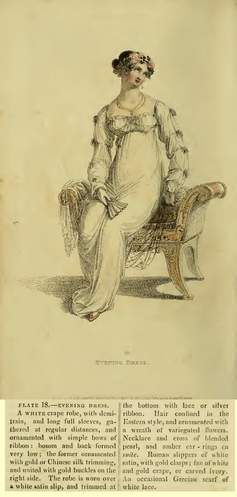

Half Dress
An Egyptian head-dress of silver and pearls, one point falling on the
left shoulder, finished with a tassel; the hair in loose ringlets; pearl ear-rings, bracelets, and necklace; a train dress of brocaded sarsenet,
trimmed with silver and vandyked; lace round the neck in form of a
tucker, long sleeves of Mecklin or Brussels lace; white gloves and
fan; shoes the same as the dress, of brocaded silk, with silver bows.